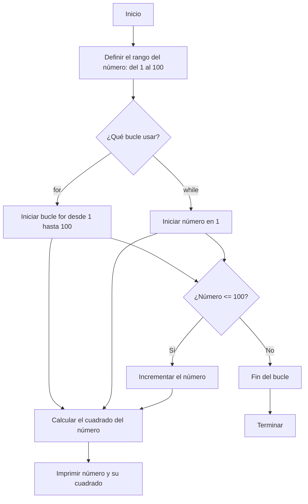

# Reto-N6

```mermaid
graph TD
    A[Inicio] --> B[Definir el rango del número: del 1 al 100]
    B --> C{¿Qué bucle usar?}
    C -->|for| D[Iniciar bucle for desde 1 hasta 100]
    C -->|while| E[Iniciar número en 1]
    D --> F[Calcular el cuadrado del número]
    E --> F
    F --> G[Imprimir número y su cuadrado]
    D --> H{¿Número <= 100?}
    E --> H
    H -->|Sí| I[Incrementar el número]
    I --> F
    H -->|No| J[Fin del bucle]
    J --> K[Terminar]
```
