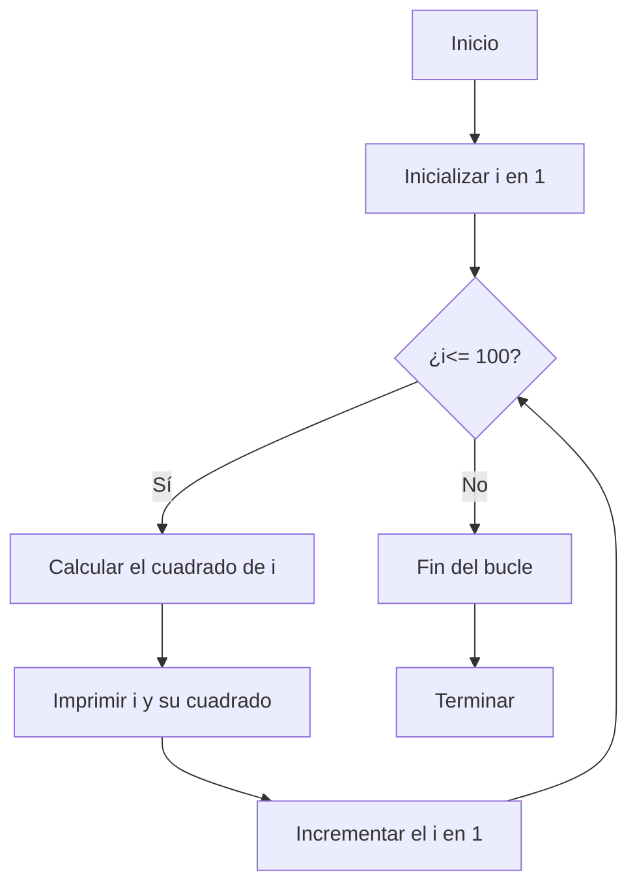

# Reto-N6
Para los 3 primeros puntos, se realizo el diagrama de flujo teniendo en cuenta la forma de resolverlo mediante el ciclo while 
Punto 1

```mermaid
graph TD
    A[Inicio] --> B[Inicializar i en 1]
    B --> C{¿i<= 100?}
    C -->|Sí| D[Calcular el cuadrado de i]
    D --> E[Imprimir i y su cuadrado]
    E --> F[Incrementar el i en 1]
    F --> C
    C -->|No| G[Fin del bucle]
    G --> H[Terminar]
```
